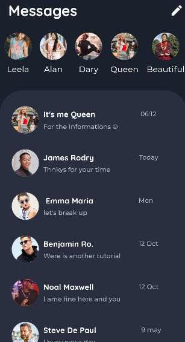
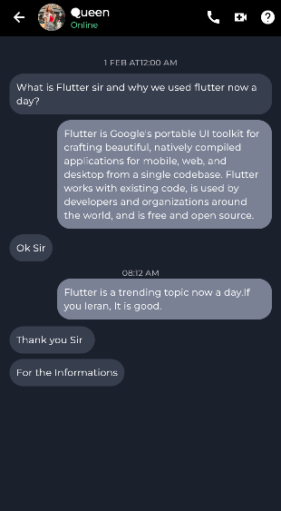

# 📱 Chat App UI Design

A simple **Flutter** project that showcases a clean and modern **chat application user interface**.

## 🚀 Features
- Beautiful and responsive UI
- Chat list screen
- Chat detail screen
- Custom colors and typography
- Organized Flutter widgets

## 🛠️ Technologies Used
- Flutter
- Dart
- Material Design

## 📸 Screenshots

| Home Screen | Chat Screen |
|-------------|-------------|
|  |  |

## 💡 Future Improvements
- Add authentication (Firebase or other)
- Connect to a backend for real chat
- Dark mode support

## 📬 Contact
Created by [Belaggoun Amina](https://github.com/Blg-amina) – feel free to connect!
